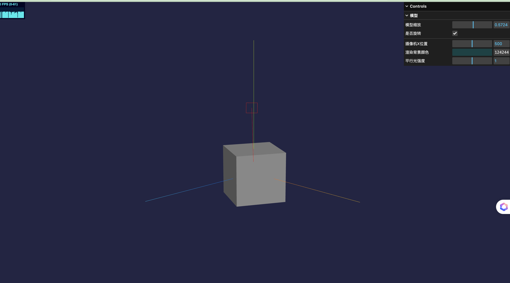

## three.js

### gui 调试工具

```
import { GUI } from "three/addons/libs/lil-gui.module.min.js";
const gui = new GUI();
const meshFolder = gui.addFolder("模型"); // 分组
meshFolder
  .add({ scale: 1 }, "scale", 0.1, 1)
  .name("模型缩放")
  .onChange((v) => {
    mesh.scale.set(v, v, v);
  });
```


